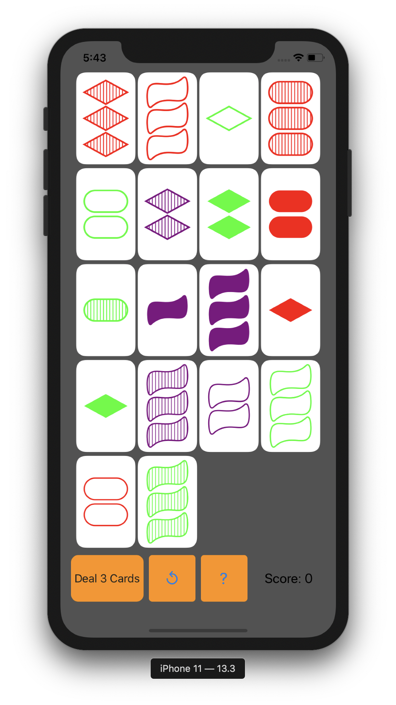
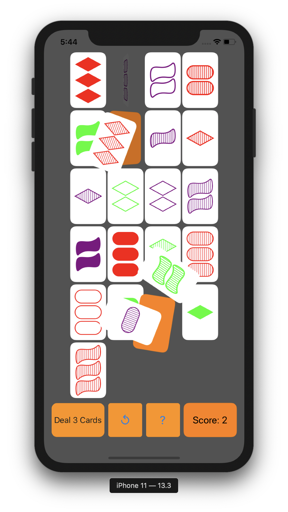

# GameOfSet
GameOfSet is an iOS app of a well known card game called __Set__.

## Rules of Set
In this game, there are fixed number of cards. On each card, there are 1, 2 or 3 numbers of identical drawings. This drawing has 3 unique attributes. First is the shape, which can be of 3 kinds i.e. Oval, Diamond & Squiggly. Second is the shading, which again can be off 3 kinds i.e. solid, striped & empty. Third is the color, which also can be of 3 kinds, i.e. red, green & purple.

So in summary a card has 4 attributes:
* Number of shapes (1, 2 or 3)
* Shape type (Oval, Diamond or Squiggly)
* Shading (Solid, Striped or Empty)
* Color (Red, Green or Purple)

In total we can have 81 combinations (3x3x3x3), so there are total 81 cards in the game.

The player of the game has to make a __Set__ using 3 cards. A set has to have either all attributes the same or all different. E.g. a set needs to have same number of shapes or all 3 different. Similarly, the shape type has to be same or all different on the 3 cards.

## How to play this game
The game starts with 12 cards. At any point of time, you can add more cards.
You have to select 3 cards to form the Set.
If the selected cards form a Set, you will score 3 points. The matched cards will fly out and 3 new cards will replace them.
And if the cards don't form a set, then you will lose a point and the selected cards will shake to tell you that it's a non-match.

At any time, if you are unable to find a Set, then you can use the **?** button to find a set but it will cost you 2 points.
Use the **⟲** button to restart the game at any point.

## General Info
This project started as implementation of an assignment in an [iOS Development course on YouTube](https://www.youtube.com/playlist?list=PLPA-ayBrweUzGFmkT_W65z64MoGnKRZMq).

The features related to animations (and other UIKit features in general) that I have implemented here are:
* Timers
* Affine Transformations
* Animations using **UIViewPropertyAnimator** and **UIView transitions**
* Dynamic animations using **UIKit Dynamics**
* Bezier paths

### Highlight of this project
The thing I want to specially highlight is the use of Bezier paths to **draw** the shapes and not use any images. As expected, this results in beautiful and sharp graphics of the shapes.

Drawing the squiggly shape was particularly difficult as it required using **four cubic Bézier curves**. I found it impossible to create the shape directly in the app as I couldn't experiment with control points visually.

To achieve that, I first created the shape on the popular online graphing application **Desmos**. There I could just drag around the control points and get the perfect squiggly shape.

Once I had the numbers for the control points, it became straightforward to create the shape in the app.

The graph created on Desmos for squiggly is available [here](https://www.desmos.com/calculator/7xa38awbsv).

## Screenshots

<!--

-->

Normal state|Game Starting|Set formed
---|---|---
||

#### GIFs
Game Starting|Addition of more cards
---|---
|

Set formed|Failed to form a Set
---|---
|

## Project Status
The project is still not fully complete and might also have some bugs. I plan to work more on the animation aspects and bring in even cooler animations and effects.
There is tremendous scope to add more features like multi-player, time bound scoring, scoring history etc.
